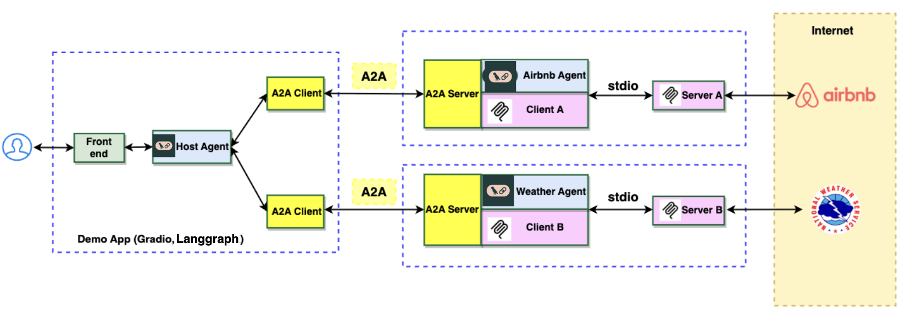
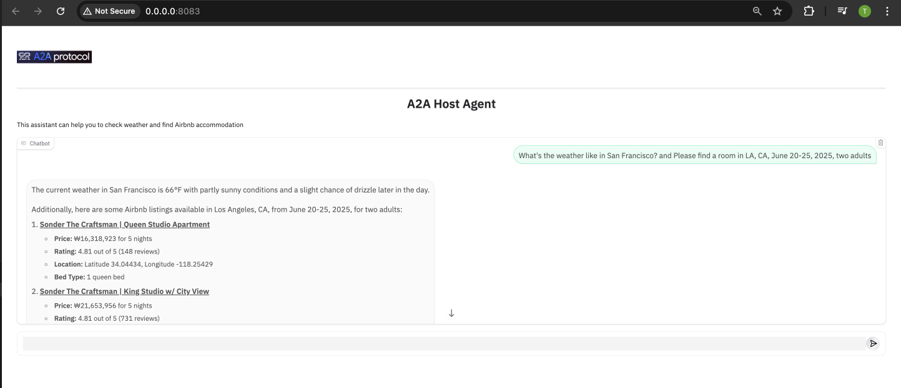

# Build Agents using A2A SDK
----
> *⚠️ DISCLAIMER: THIS DEMO IS INTENDED FOR DEMONSTRATION PURPOSES ONLY. IT IS NOT INTENDED FOR USE IN A PRODUCTION ENVIRONMENT.*  

> *⚠️ Important: A2A is a work in progress (WIP) thus, in the near future there might be changes that are different from what demonstrated here.*
----

This document describes a web application demonstrating the integration of Google's Agent to Agent (A2A), Agent Development Kit (ADK) for multi-agent orchestration with Model Context Protocol (MCP) clients. The application features a host agent coordinating tasks between remote agents that interact with various MCP servers to fulfill user requests.

### Architecture

The application utilizes a multi-agent architecture where a host agent delegates tasks to remote agents (Airbnb and Weather) based on the user's query. These agents then interact with corresponding MCP servers.



### App UI


## Setting Up MCP Server Locally

### Prerequisites
- Python 3.8+
- FastAPI
- httpx
- Required Python packages for specific functionality (e.g., geopy for weather service)

### Steps to Set Up MCP Server

1. **Initialize MCP Server**
   ```python
   from mcp.server.fastmcp import FastMCP
   
   # Initialize with a unique name
   mcp = FastMCP('service_name')
   ```

2. **Define MCP Tools**
   ```python
   @mcp.tool()
   async def your_tool_name(param1: str, param2: int) -> str:
       """Tool description and documentation.
       
       Args:
           param1: Description of param1
           param2: Description of param2
           
       Returns:
           Description of return value
       """
       # Tool implementation
       return result
   ```

3. **Run MCP Server**
   ```python
   if __name__ == '__main__':
       mcp.run(transport='stdio')  # For local development
   ```

### Example MCP Implementation (Weather Service)
```python
# Initialize FastMCP server
mcp = FastMCP('weather')

@mcp.tool()
async def get_forecast(latitude: float, longitude: float) -> str:
    """Get weather forecast for a location."""
    # Implementation
    return forecast_data

@mcp.tool()
async def get_alerts(state: str) -> str:
    """Get weather alerts for a state."""
    # Implementation
    return alerts_data
```

## Connecting MCP with Agents

### Agent Structure
1. **Base Components**
   - Agent class (e.g., WeatherAgent)
   - Agent executor
   - Configuration files
   - MCP client integration

2. **Agent Implementation**
   ```python
   class WeatherAgent:
       def __init__(self, mcp_tools: List[Any]):
           self.model = azure_gpt4o_mini
           self.mcp_tools = mcp_tools
           self.memory = MemorySaver()
           self.agent_runnable = create_react_agent(
               model=self.model,
               tools=self.mcp_tools,
               checkpointer=self.memory,
               prompt=self.SYSTEM_INSTRUCTION
           )
   ```

3. **MCP Integration**
   - Agents use MCP tools through the agent_runnable
   - Tools are passed during agent initialization
   - Responses are processed and formatted according to defined schemas

## A2A Agent Structure

### Core Components
1. **Agent Class**
   - System instructions
   - Response format definitions
   - Tool integration
   - State management

2. **Agent Executor**
   - Handles message processing
   - Manages async operations
   - Implements streaming capabilities

3. **Configuration**
   - Model settings
   - API endpoints
   - System parameters

### Example Agent Structure
```
agent_name/
├── __init__.py
├── __main__.py          # Entry point
├── agent.py             # Core agent implementation
├── agent_executor.py    # Execution logic
├── configs.py           # Configuration
└── test_agent.py        # Tests
```

## Building a Host Agent for Multiple Agents

### Host Agent Implementation

1. **Initialization**
   ```python
   class RouterAgent:
       def __init__(self, remote_agent_addresses: list[str]):
           self.remote_agent_addresses = remote_agent_addresses
           self.model = azure_gpt4o_mini
           self.agents_info = None
           self.agent_runnable = None
   ```

2. **Agent Discovery and Connection**
   - Resolves agent cards from remote addresses
   - Establishes connections with remote agents
   - Maintains connection pool

3. **Message Routing**
   - Analyzes user queries
   - Selects appropriate agent(s)
   - Manages message flow

4. **State Management**
   - Tracks active conversations
   - Maintains context
   - Handles agent responses

### Key Features

1. **Dynamic Agent Discovery**
   - Automatically discovers available agents
   - Resolves agent capabilities
   - Maintains agent registry

2. **Intelligent Routing**
   - Context-aware message routing
   - Multi-agent task coordination
   - Error handling and recovery

3. **Message Flow Control**
   - Asynchronous message processing
   - Response aggregation
   - Stream management

### Example Host Agent Configuration
```python
SYSTEM_INSTRUCTION = """
Role: Expert Routing Delegator
Primary function: Delegate user inquiries to specialized remote agents
Core Directives:
- Task Delegation
- Contextual Awareness
- Autonomous Agent Engagement
- Transparent Communication
"""
```

## Best Practices

1. **Error Handling**
   - Implement robust error handling
   - Provide meaningful error messages
   - Handle network failures gracefully

2. **Testing**
   - Unit tests for individual components
   - Integration tests for agent interactions
   - End-to-end testing for complete flows

3. **Security**
   - Implement proper authentication
   - Secure communication channels
   - Handle sensitive data appropriately

4. **Monitoring**
   - Log important events
   - Track agent performance
   - Monitor system health

## Getting Started

1. **Setup Environment**
   ```bash
   uv sync
   ```

2. **Launch Agents**
   ```bash
   cd weather_agent
   uv run .

   cd airbnb_agent
   uv run .
   ```

3. **Start Host Agent**
   ```bash
   cd host_agent
   uv run .
   ```

## Contributing

Please read CONTRIBUTING.md for details on our code of conduct and the process for submitting pull requests.

## License

This project is licensed under the MIT License - see the LICENSE file for details.
